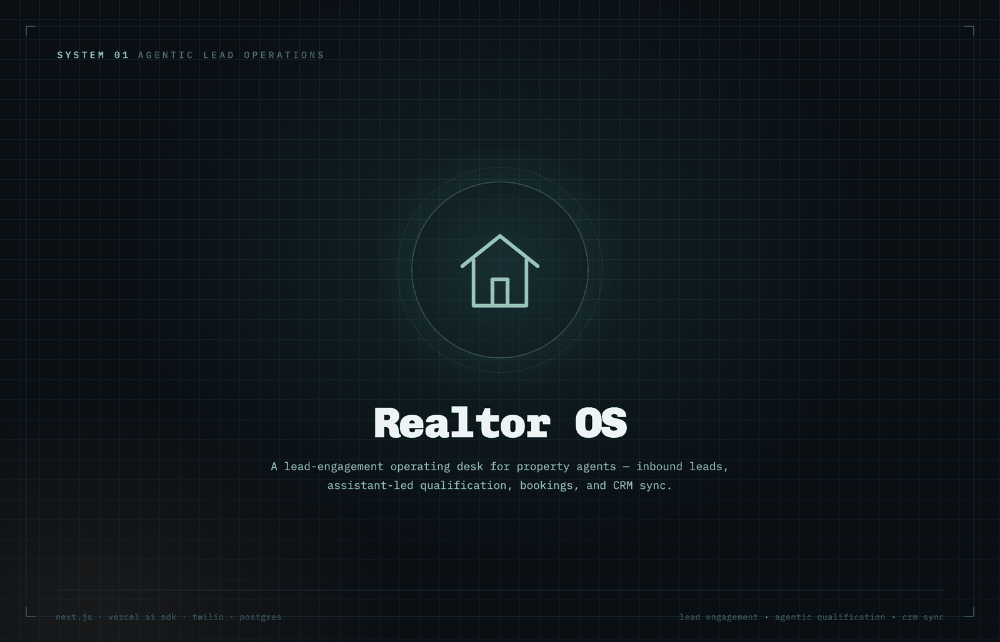
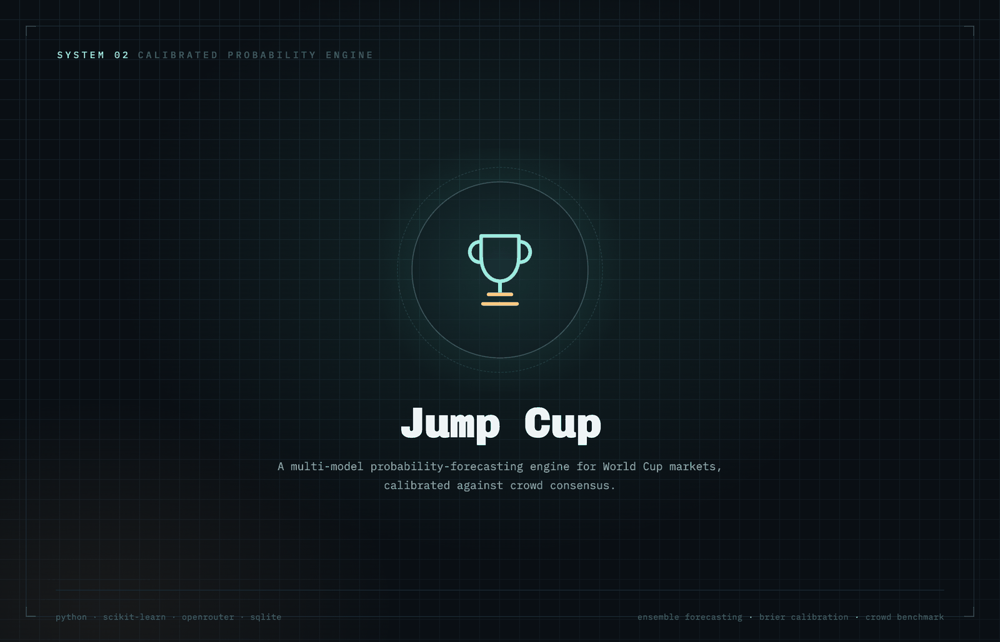
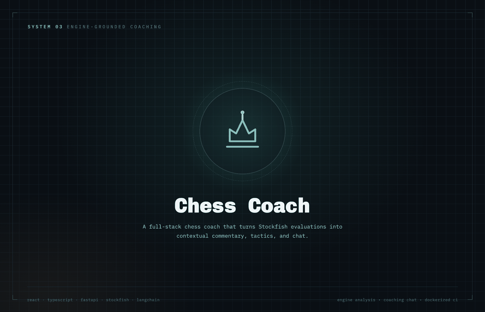
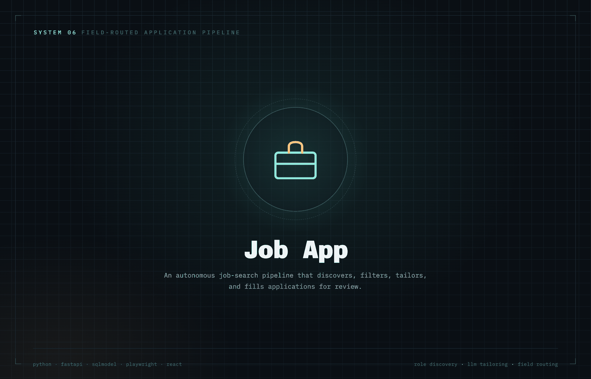
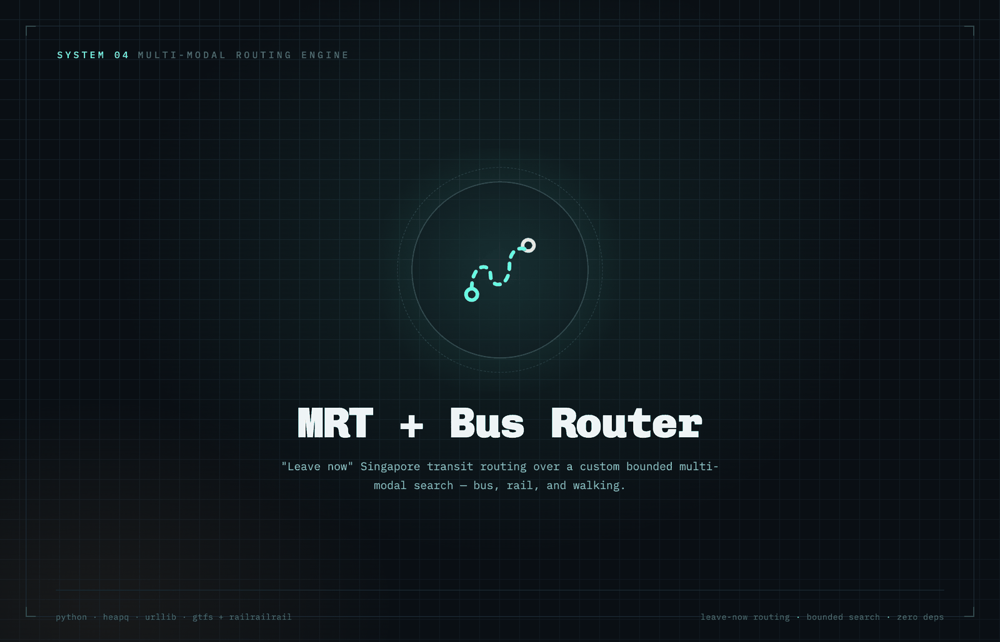
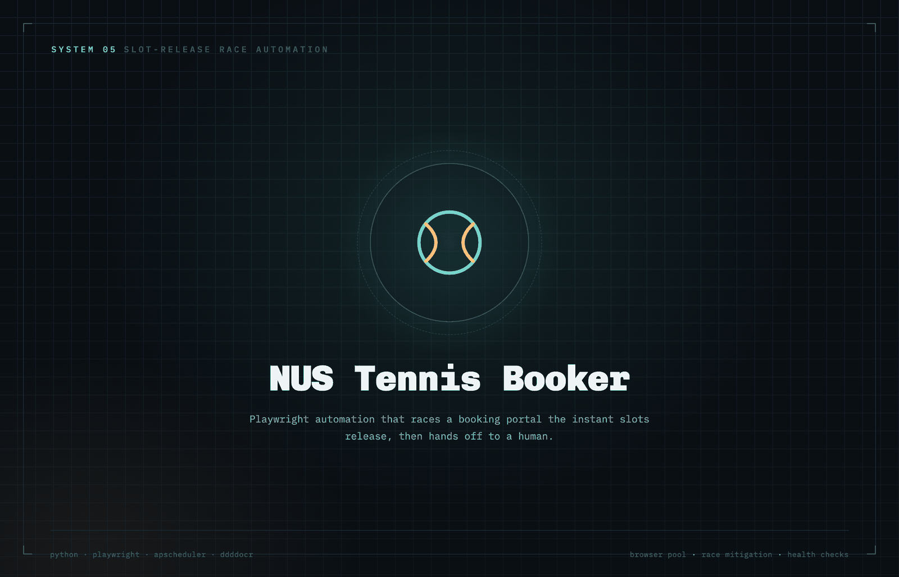

# Wu Yekai

**Software engineer building agentic products, decision systems, and data-rich tools.**

[Portfolio](https://yekaiwu.github.io) &nbsp;·&nbsp; [LinkedIn](https://www.linkedin.com/in/yekaiwu/) &nbsp;·&nbsp; [Email](mailto:wuyekai.sg@gmail.com)

 

## Selected projects

<table>
<tr>
<td width="50%" valign="top">

### Realtor OS

A lead-engagement operating desk for property agents — inbound WhatsApp and voice leads, assistant-led qualification, bookings, inventory, and CRM sync in one runtime.

<code>Next.js</code> <code>Vercel AI SDK</code> <code>Twilio</code> <code>Postgres</code> <code>Twenty CRM</code>

</td>
<td width="50%" valign="top">

### Jump Cup

A multi-model probability-forecasting engine for World Cup markets, built around Brier-score calibration rather than confident winner picks.

<code>Python</code> <code>scikit-learn</code> <code>OpenRouter</code> <code>SQLite</code>

</td>
</tr>
<tr>
<td width="50%" valign="top">

### [Chess Coach ↗](https://github.com/yekaiwu/Chess_Coach)

A full-stack chess coach that turns Stockfish evaluations into contextual commentary, tactics, and a coaching chatbot.

<code>React</code> <code>TypeScript</code> <code>FastAPI</code> <code>Stockfish</code> <code>LangChain</code>

</td>
<td width="50%" valign="top">

### Job App

An autonomous job-search pipeline that discovers roles from public ATS boards, filters them for relevance and eligibility, tailors resume bullet points via an LLM, and fills applications through a Playwright browser session.

<code>FastAPI</code> <code>SQLModel</code> <code>Playwright</code> <code>React</code>

</td>
</tr>
<tr>
<td width="50%" valign="top">

### [MRT + Bus Router ↗](https://github.com/yekaiwu/mrt-bus)

"Leave now" Singapore transit routing over a custom bounded multi-modal search — live LTA bus arrivals, GTFS rail topology, and OneMap walking data — with zero third-party runtime dependencies.

<code>Python (stdlib)</code>

</td>
<td width="50%" valign="top">

### [NUS Tennis Booker ↗](https://github.com/yekaiwu/nus_tennis)

Playwright automation that races a university tennis-court booking portal the instant slots release, then hands the payment step to a human over Telegram.

<code>Python</code> <code>Playwright</code> <code>APScheduler</code> <code>FastAPI</code>

</td>
</tr>
</table>

## Technical skills

**Languages** &nbsp;
 

**AI & LLM systems** &nbsp;
   

**Backend & frontend** &nbsp;
   

**Data & quantitative** &nbsp;
   

**Developer tools** &nbsp;
   

 

Case studies, architecture notes, and more at <a href="https://yekaiwu.github.io">yekaiwu.github.io</a>

